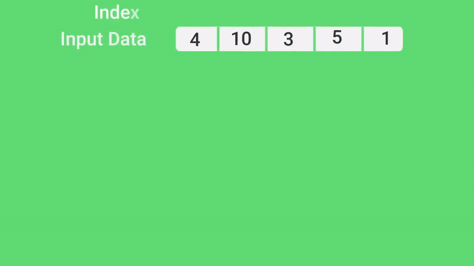

# Сортировка кучей (Heap Sort)

## Описание
Сортировка кучей — это алгоритм, который использует бинарную кучу для сортировки элементов. Он работает в два этапа: 

1. **Построение кучи**: Преобразование массива в бинарную кучу.
2. **Сортировка**: Извлечение элементов из кучи и размещение их в отсортированном порядке.

## Принцип работы
- **Бинарная куча**: Это полное двоичное дерево, где каждый родительский узел больше (или меньше) своих дочерних узлов.
- **Извлечение**: На каждом шаге извлекается наибольший элемент (корень кучи) и помещается в конец массива.

**Основная суть**
```
1. Построение бинарной кучи(у нас max-heap) из исходных данных;

// На данном этапе самый большой элемент хранится в корне кучи.
2. While (В куче больше одного элемента) {
       Меняем местами первый и последний элемент;
       Теперь первый элемент, который стал последним мы больше не трогаем и удаляем из нашего дерева;
    }                                               
return 0;   //  😋
```

## Пример:


## Временная сложность
- **Лучший случай**: O(n log n)
- **Средний случай**: O(n log n)
- **Худший случай**: O(n log n)

## Применение
Сортировка кучей эффективна для сортировки больших массивов и используется в различных приложениях, где важна производительность.


Вход:
строка 1:
	целое N от 0 до 2000000 -- длина массива
строка 2:
	N целых чисел -- значения элементов массива

Выход:
	Значения элементов массива упорядоченные по возрастанию с помощью алгоритма Heap Sort, разделенные пробелами.
	Время на сортировку -- 3 секунды.

Исполняемый файл + данные не более 4 * N + 4Mb

Пример 1
Вход:
3
4 -1 2
Выход:
-1 2 4


Пример 2
Вход:
3
0 0 -1
Выход:
-1 0 0
